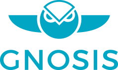

# Gnosis.js Library 

[](https://gnosis.pm/)

[](https://slack.gnosis.pm)

## Installation

Run `npm install` to install dependencies.

Needs a Web3 provider to work. For testing, try TestRPC.

## Development

Before you begin, you will want to have the contracts deployed on the chain you plan to use. You can deploy contracts through the RPC interface on localhost:8545 with

```
npm run migrate
```

The build process using Truffle will insert the chain locations in a `networks` key on the contract build artifacts.

### Building

You can run `npm run nodebuild` to build the library for Node.js use.

You can also run `npm run webbuild` to build the library targeting the web. Note that this will compile in all network information present in the build artifacts, including temporary network information generated by TestRPC during migrations. You may use `npm run netclean` beforehand to remove unofficial network info if desired.

### Running the dev server

Run `npm run dev` to run the dev server and serve the examples. The library source will be continuously recompiled. Examples will be available on http://localhost:8080. Don't forget to refresh the page after you change the source.

### Running the tests

Run `npm test` to run test suite. This should run without the need of an RPC provider running on localhost:8545. If you already have such a provider running and wish to run the test suite without automatically spinning up TestRPC and causing a chain migration, use `npm run test-manual`.

### Running the docs

Run `npm run doc` to run and open the jsdocs in your browser.
